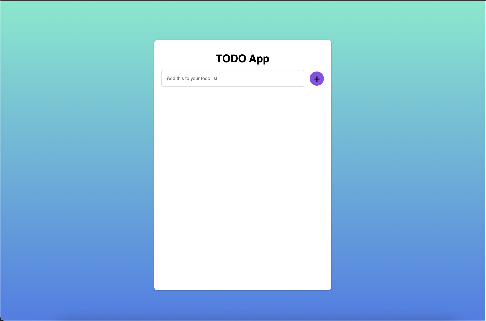
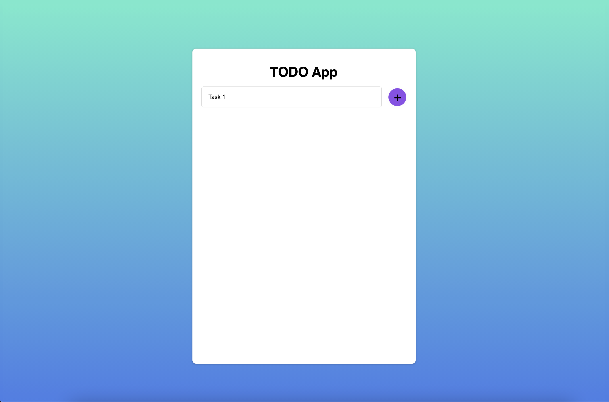
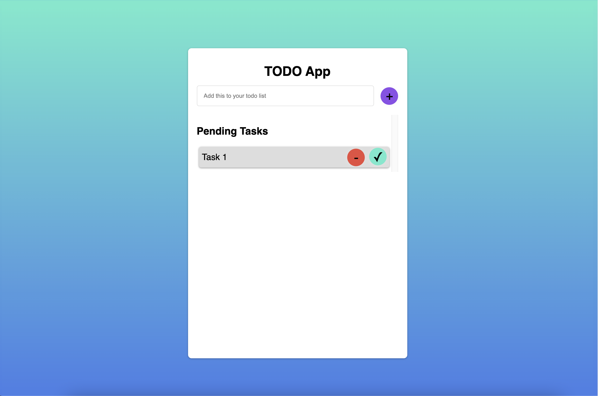
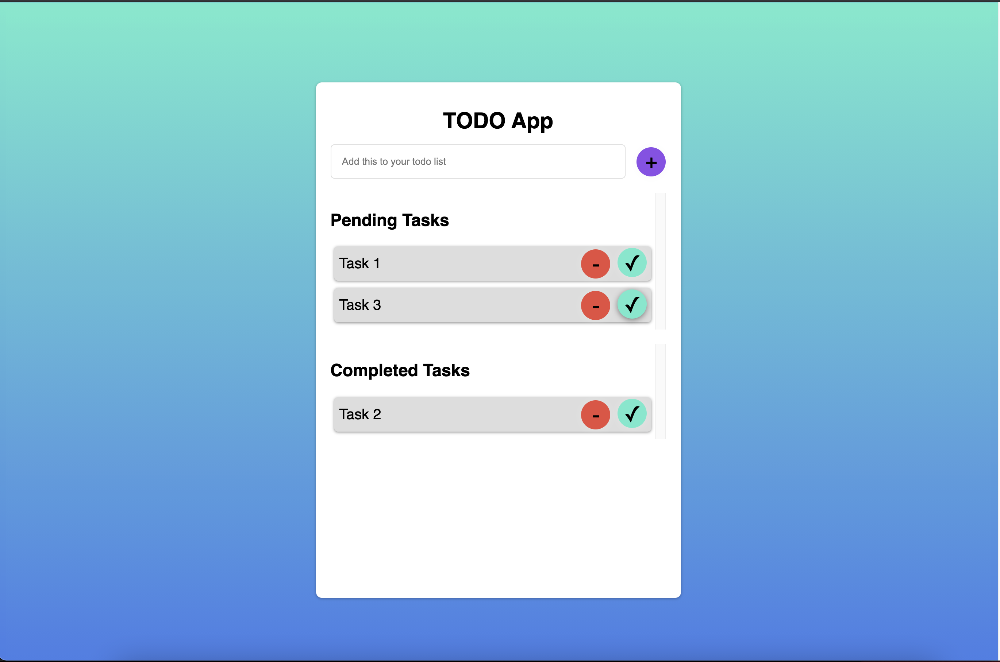
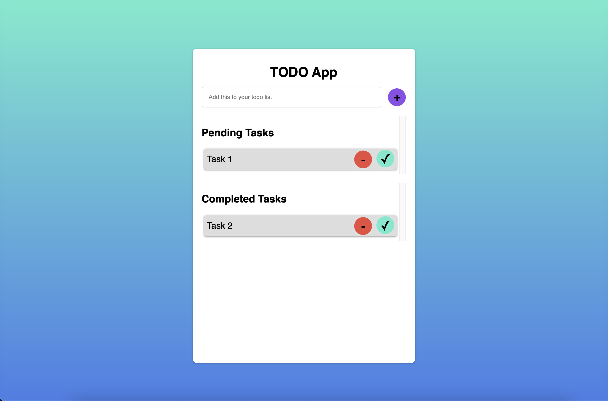

## SIMPLE TODO

- Implement a Todo App with following Functionalities
    - A simple interface to create a todo
    
    - Write your task description in brief and then click add icon
    
    - After Adding the task it should be visible in the pending list
    
    - You have two icons in the task list items
        - Remove Task Icon
        - Complete Task Icon
        - Clicking on Complete Task Icon should add the item form pending list to completed task list
        
        **Note: If you are going to click on the complete icon on the completed task list nothing should happend as the task is already completed**
        - Clicking on Remove Task Icon should remove the item form the task list
        

- The above mentioned functionalities were of a simple todo app.
    - You need to persist your todo app list, even if the user closes the browser,
        i.e. if he revisits your todo app, he should be able to get his todo list that he had created.
    - **Hint: Read about Web Storage**

### Plus Points
- If you can use better icons
- If you can come up with new innovative idea to make your todo app better, like using animations, good designs
- If you can differentiate between each of the Web Storage, and their use cases

**Note: Plus Points are not necessarry it's just to enhance your personal development, other than Plus Points, The functionalities of the todo app mentioned should be same**
        